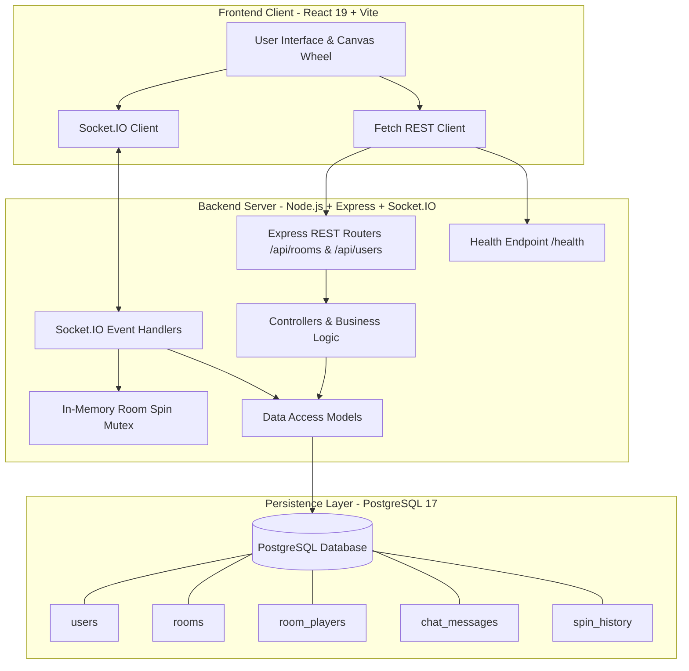
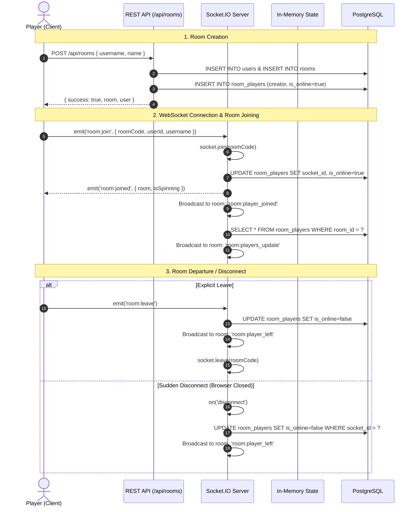
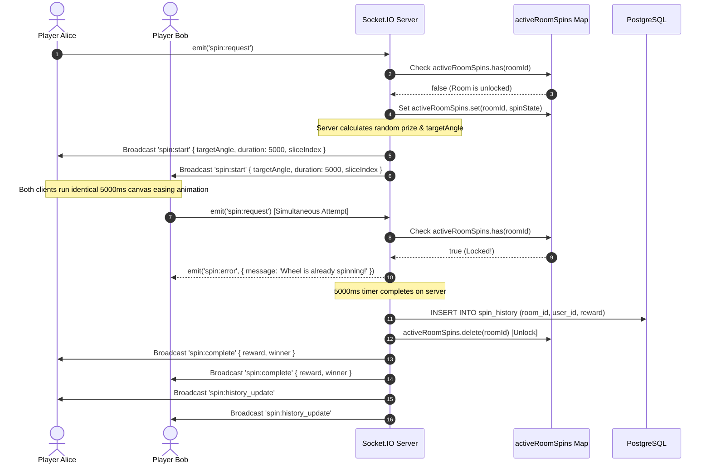

# System Architecture

## 1. High-Level System Flow

The application follows an event-driven, client-server architecture. The React frontend interacts with the Node.js backend through two distinct channels:
1. **REST APIs**: Synchronous data retrieval for initial page loads (room metadata, chat archives, spin histories).
2. **WebSocket (Socket.IO)**: Low-latency, bidirectional event streaming for live game actions, player presence, chat broadcasts, and shared wheel rotations.



---

## 2. Room Lifecycle



---

## 3. Spin Wheel Workflow & Concurrency Protection

The wheel mechanism is strictly **server-authoritative**. Clients cannot determine the winning reward; they only render an animation based on instructions calculated by the backend.

### Concurrency Protection (Spin Mutex)
When multiple players attempt to spin the wheel at the same time:
1. The server checks an in-memory lock map: `activeRoomSpins.has(roomId)`.
2. If the room is already spinning, the server rejects subsequent requests with a `spin:error` event: `"Wheel is already spinning! Please wait for the current round to complete."`.
3. If the wheel is free, the server acquires the lock, picks the winning slice, broadcasts `spin:start`, and starts a server-side completion timer (5000ms).



### Target Angle Calculation
To ensure that all connected screens visually land on the exact slice chosen by the server:
- The total wheel angle is 360 degrees divided by total slices (8 slices = 45 degrees per slice).
- The server selects winning slice index `i` (0 to 7) based on weighted probability.
- Target angle formula:
  $$\text{Target Angle} = (5 \times 360) + (360 - (\text{index} \times 45 + 22.5))$$
- 5 full revolutions (1800 degrees) provide dramatic spin acceleration and deceleration, while the offset centers the pointer directly on the winning slice.

---

## 4. Real-Time Communication Architecture

Socket.IO partitions connections into virtual channels called **Rooms**, keyed by `room_code` (e.g. `7AU9SU`).

### Channel Isolation
- When a socket emits a chat message (`chat:message`), the server persists it to PostgreSQL and broadcasts exclusively to `io.to(currentRoomCode).emit('chat:received', ...)`.
- Players in room `ROOM_A` never receive messages, player join alerts, or spin animations intended for room `ROOM_B`.

### Resilience and Reconnection
- The client socket instance is configured with automatic reconnection backoff:
  ```javascript
  const socket = io(SERVER_URL, {
    transports: ['websocket', 'polling'],
    reconnectionAttempts: 10,
    reconnectionDelay: 1000,
  });
  ```
- If a temporary network interruption occurs, the client automatically attempts reconnection. Upon reconnecting, the server updates `socket_id` and restores online status in `room_players`.
