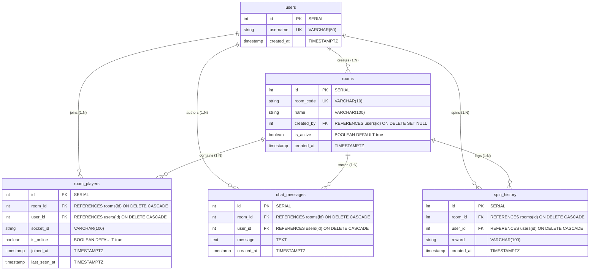

# Database Schema Documentation

## 1. Entity-Relationship (ER) Diagram

### Mermaid Representation


### ASCII Representation
```
+------------------+         +-----------------------+
|      users       |         |         rooms         |
+------------------+         +-----------------------+
| id (PK)          |<---+    | id (PK)               |<-------+
| username (UNIQUE)|    |    | room_code (UNIQUE)    |        |
| created_at       |    |    | name                  |        |
+------------------+    |    | created_by (FK)-------+        |
      |                 |    | is_active             |        |
      |                 |    | created_at            |        |
      |                 |    +-----------------------+        |
      |                 |                 |                   |
      +--------+        |                 |                   |
               |        |                 |                   |
               v        |                 v                   |
     +--------------------+     +---------------------+       |
     |    room_players    |     |    chat_messages    |       |
     +--------------------+     +---------------------+       |
     | id (PK)            |     | id (PK)             |       |
     | room_id (FK)-------+     | room_id (FK)--------+       |
     | user_id (FK)-------+     | user_id (FK)--------+       |
     | socket_id          |     | message             |       |
     | is_online          |     | created_at          |       |
     | joined_at          |     +---------------------+       |
     | last_seen_at       |                 |                 |
     | [UNIQUE(room,user)]|                 |                 |
     +--------------------+                 v                 |
               |                  +--------------------+      |
               +----------------->|    spin_history    |      |
                                  +--------------------+      |
                                  | id (PK)            |      |
                                  | room_id (FK)-------+------+
                                  | user_id (FK)--------------+
                                  | reward             |
                                  | created_at         |
                                  +--------------------+
```

---

## 2. Table Definitions

### 1. `users` Table
Stores unique player profiles across sessions.

| Column | Type | Constraints | Description |
| :--- | :--- | :--- | :--- |
| `id` | `SERIAL` | `PRIMARY KEY` | Unique autoincrementing user identifier |
| `username` | `VARCHAR(50)` | `NOT NULL, UNIQUE` | Unique player handle / nickname |
| `created_at` | `TIMESTAMPTZ` | `DEFAULT CURRENT_TIMESTAMP` | Account registration timestamp |

---

### 2. `rooms` Table
Stores game rooms created by users.

| Column | Type | Constraints | Description |
| :--- | :--- | :--- | :--- |
| `id` | `SERIAL` | `PRIMARY KEY` | Unique autoincrementing room identifier |
| `room_code` | `VARCHAR(10)` | `NOT NULL, UNIQUE` | Random 6-character room access code (e.g. `7AU9SU`) |
| `name` | `VARCHAR(100)` | `NOT NULL` | Human-readable room title |
| `created_by` | `INT` | `REFERENCES users(id) ON DELETE SET NULL` | ID of the host/creator |
| `is_active` | `BOOLEAN` | `DEFAULT TRUE` | Active room flag |
| `created_at` | `TIMESTAMPTZ` | `DEFAULT CURRENT_TIMESTAMP` | Room creation timestamp |

---

### 3. `room_players` Table
Manages the many-to-many relationship between users and rooms, tracking real-time presence.

| Column | Type | Constraints | Description |
| :--- | :--- | :--- | :--- |
| `id` | `SERIAL` | `PRIMARY KEY` | Unique record identifier |
| `room_id` | `INT` | `NOT NULL, REFERENCES rooms(id) ON DELETE CASCADE` | Associated room |
| `user_id` | `INT` | `NOT NULL, REFERENCES users(id) ON DELETE CASCADE` | Associated player |
| `socket_id` | `VARCHAR(100)` | `NULLABLE` | Current active Socket.IO connection ID |
| `is_online` | `BOOLEAN` | `DEFAULT TRUE` | Live presence flag |
| `joined_at` | `TIMESTAMPTZ` | `DEFAULT CURRENT_TIMESTAMP` | Initial room entry timestamp |
| `last_seen_at` | `TIMESTAMPTZ` | `DEFAULT CURRENT_TIMESTAMP` | Heartbeat / last activity timestamp |

**Unique Constraint**:
```sql
CONSTRAINT unique_room_user UNIQUE (room_id, user_id)
```
Prevents duplicate membership rows for the same user in a room, supporting upsert (`ON CONFLICT (room_id, user_id) DO UPDATE`).

---

### 4. `chat_messages` Table
Stores all messages exchanged inside room chat channels.

| Column | Type | Constraints | Description |
| :--- | :--- | :--- | :--- |
| `id` | `SERIAL` | `PRIMARY KEY` | Unique message identifier |
| `room_id` | `INT` | `NOT NULL, REFERENCES rooms(id) ON DELETE CASCADE` | Room where message was posted |
| `user_id` | `INT` | `NOT NULL, REFERENCES users(id) ON DELETE CASCADE` | Sender's user ID |
| `message` | `TEXT` | `NOT NULL` | Chat message text content |
| `created_at` | `TIMESTAMPTZ` | `DEFAULT CURRENT_TIMESTAMP` | Timestamp message was sent |

---

### 5. `spin_history` Table
Immutable ledger of all wheel spin outcomes.

| Column | Type | Constraints | Description |
| :--- | :--- | :--- | :--- |
| `id` | `SERIAL` | `PRIMARY KEY` | Unique spin record identifier |
| `room_id` | `INT` | `NOT NULL, REFERENCES rooms(id) ON DELETE CASCADE` | Room where spin occurred |
| `user_id` | `INT` | `NOT NULL, REFERENCES users(id) ON DELETE CASCADE` | Player who spun the wheel |
| `reward` | `VARCHAR(100)` | `NOT NULL` | Name of the reward won (e.g. `Jackpot 1000!`) |
| `created_at` | `TIMESTAMPTZ` | `DEFAULT CURRENT_TIMESTAMP` | Timestamp the spin finished |

---

## 3. Database Indexes

To maintain sub-millisecond query performance during high-frequency room interactions, indexes are created on all foreign keys and lookup columns:

```sql
CREATE INDEX IF NOT EXISTS idx_rooms_code ON rooms(room_code);
CREATE INDEX IF NOT EXISTS idx_room_players_room_id ON room_players(room_id);
CREATE INDEX IF NOT EXISTS idx_room_players_user_id ON room_players(user_id);
CREATE INDEX IF NOT EXISTS idx_chat_messages_room_id ON chat_messages(room_id);
CREATE INDEX IF NOT EXISTS idx_spin_history_room_id ON spin_history(room_id);
```

---

## 4. Migration Execution

The database schema can be executed in two ways:
1. **Via Node migration runner**:
   ```bash
   npm run db:migrate
   ```
2. **Via PostgreSQL CLI**:
   ```bash
   psql -U postgres -d spinwheel_db -f server/db/schema.sql
   ```
3. **Via Docker Compose**:
   Automatically mounted to `/docker-entrypoint-initdb.d/init.sql` on container initialization.
